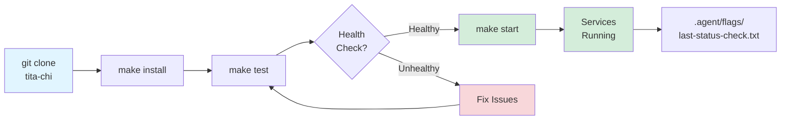
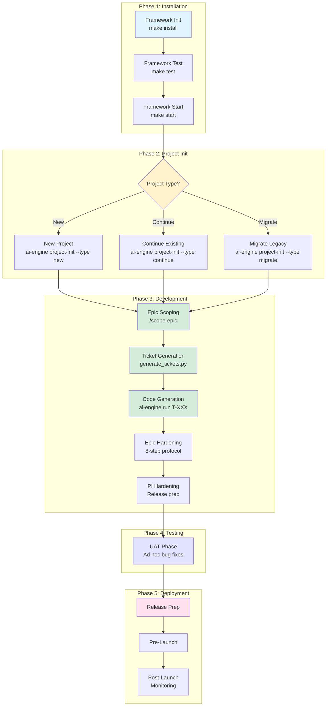
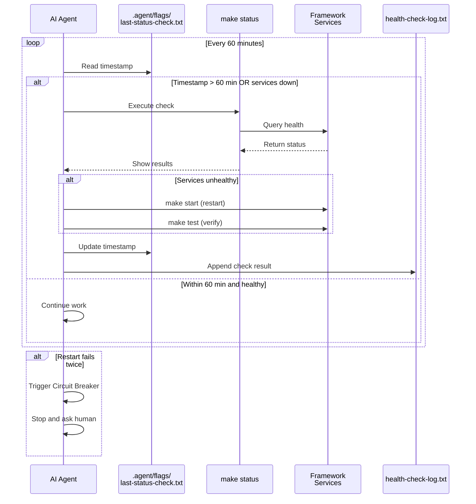
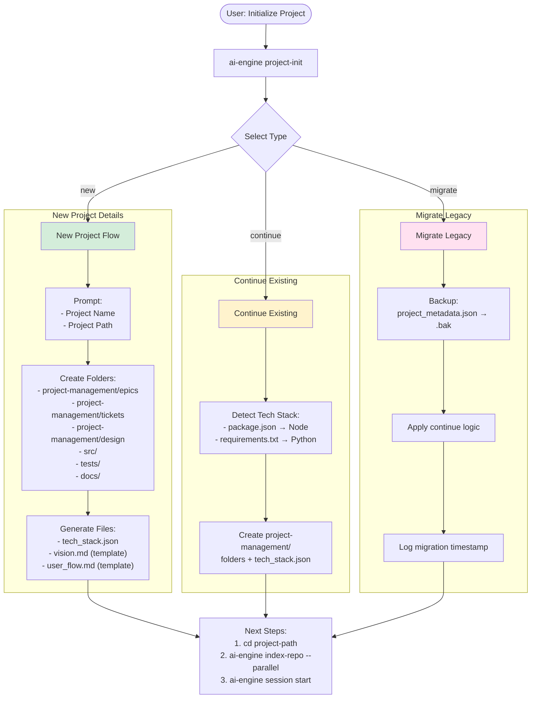
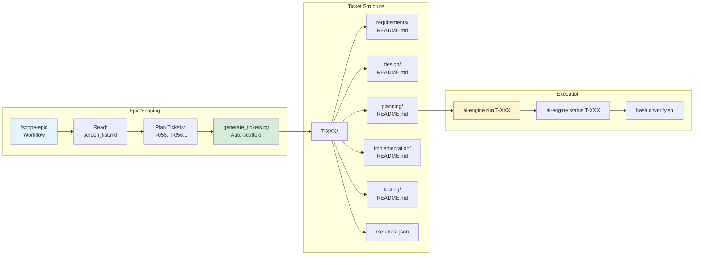
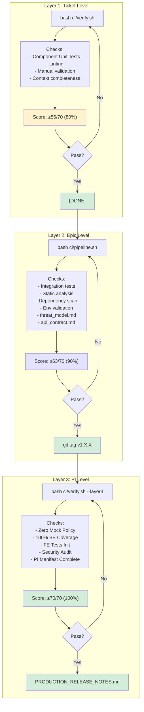
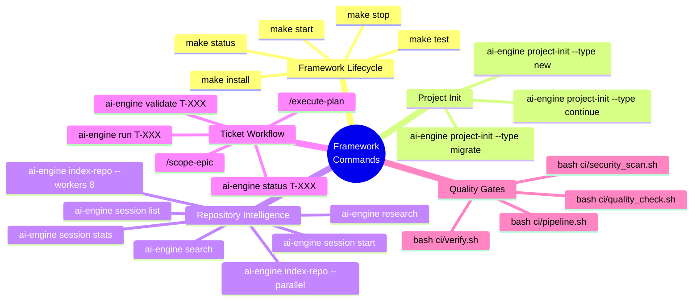
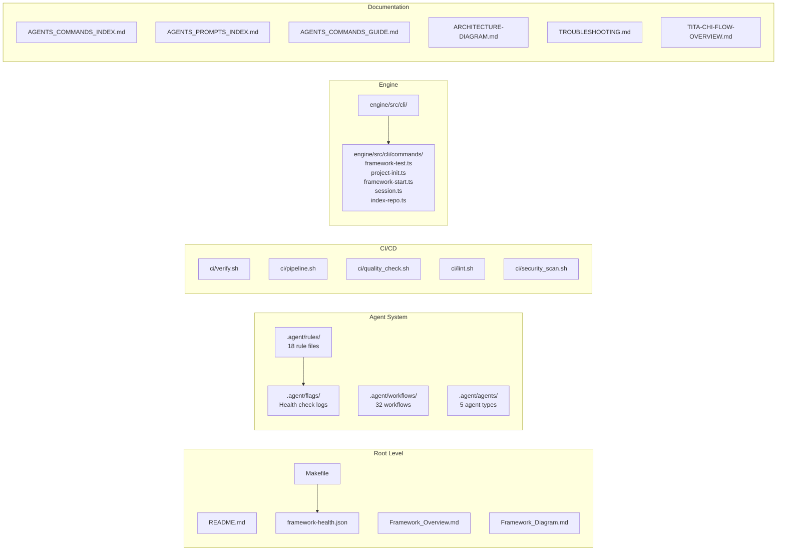
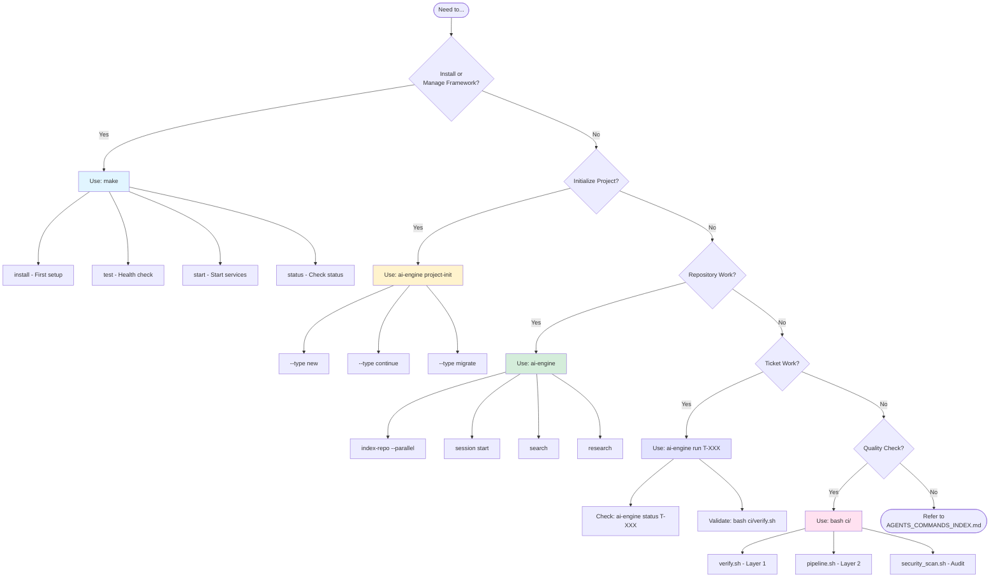

# AI Assisted Development Framework - Architecture Diagrams

> **Visual representation of the AI Assisted Development Framework architecture, phases, and workflows**

---

## 1. AI Assisted Development Framework Lifecycle (6 Phases)

```
+==============================================================================+
|                      AI ASSISTED DEVELOPMENT FRAMEWORK v1.0 -- COMPLETE SYSTEM MAP            |
+==============================================================================+


================================================================================
 1. THE LIFECYCLE -- How a project flows from idea to production
================================================================================

  +---------------+   +---------------+   +---------------+   +---------------+
  |  Phase 1      |-->|  Phase 2      |-->|  Phase 3      |-->|  Phase 4      |
  |  INSTALL      |   |  PROJECT INIT |   |  DEVELOPMENT  |   |  TESTING      |
  +-------+-------+   +-------+-------+   +-------+-------+   +-------+-------+
          |                   |                   |                   |
   make install      ai-engine        Epic Scoping        UAT Phase
   make test         project-init     Ticket Gen          Bug Fixes
   make start        vision.md        Code Gen            Validation
   Hourly Check      user_flow.md     Epic Hardening      QA Cycle
          |                   |                   |                   |
          v                   v                   v                   v
  +-------+-------+   +-------+-------+   +-------+-------+   +-------+-------+
  |  Phase 5      |   |  Phase 6      |   |               |   |               |
  |  DEPLOYMENT   |-->|  MAINTENANCE  |   |               |   |               |
  +-------+-------+   +---------------+   +---------------+   +---------------+
          |
   Release Prep
   Pre-Launch
   Post-Launch
   Monitoring
          |
          v
  +----------------------------------+
  |      PRODUCTION / LIVE           |
  +----------------------------------+


================================================================================
 2. PHASE 1 DETAIL -- Installation Process
================================================================================

  +---------------+     +---------------+     +---------------+
  | Prerequisites | --> | Install Deps  | --> | Health Check  |
  |  Check        |     |  & Services   |     |  (JSON out)   |
  +-------+-------+     +-------+-------+     +-------+-------+
          |                     |                     |
     Node.js | npm          engine npm i        framework-health.json
     Python | Docker        memory npm i        Check: Qdrant, Ollama,
     Ollama install        Qdrant Docker         SQLite, Engine
                            Model pull
                            requirements.txt


================================================================================
 3. PHASE 2 DETAIL -- Project Initialization
================================================================================

                           +-----------------+
                           | ai-engine       |
                           | project-init    |
                           +--------+--------+
                                    |
              +-----------------------+-----------------------+
              |                       |                       |
        +-----v-----+          +-----v-----+          +-----v-----+
        |   NEW     |          | CONTINUE  |          |  MIGRATE  |
        |  PROJECT  |          | EXISTING  |          |  LEGACY   |
        +-----+-----+          +-----+-----+          +-----+-----+
              |                       |                       |
    Interactive       Detect Tech       Backup metadata.json
    Prompts:          Stack:            Run continue logic
    - Project Name    - package.json    Log migration
    - Project Path    - requirements.txt  timestamp
              |                       |                       |
              +-----------------------+-----------------------+
                                    |
                          +---------v---------+
                          |  Generate Folders:|
                          |  - epics/         |
                          |  - tickets/       |
                          |  - design/        |
                          |  - src/           |
                          |  - tests/         |
                          |  - docs/          |
                          +---------+---------+
                                    |
                          +---------v---------+
                          | Generate Files:   |
                          | - tech_stack.json |
                          | - vision.md       |
                          | - user_flow.md    |
                          +-------------------+


================================================================================
 4. PHASE 3 DETAIL -- Development Workflow
================================================================================

  +-----------------+     +-----------------+     +-----------------+
  |  Epic Scoping   | --> | Ticket Generate | --> |  Code Execute   |
  |  /scope-epic    |     |  generate_tickets|    |  ai-engine run  |
  +-------+---------+     +--------+--------+     +--------+--------+
          |                        |                      |
   Read: screen_list.md     Auto-create:          Breath-based
   Plan tickets needed       - Ticket folders        Execution
   (T-055, T-056...)         - planning/README.md    Autonomous |
                             - metadata.json         Manual mode
                                                     |
                                                     v
                                            +-------+--------+
                                            | Quality Gates: |
                                            | - ci/verify.sh   |
                                            | - ci/pipeline.sh |
                                            +----------------+
                                                     |
                                                     v
  +-----------------+     +-----------------+     +-----------------+
  |  Epic Hardening | <-- |  Ticket Done    | <-- |  Validate       |
  |  8-step protocol|       |  [DONE]         |       |  Score ≥56/70   |
  +-------+---------+     +-----------------+     +-----------------+
          |
          v
  +-----------------+     +-----------------+
  |  PI Hardening   | --> |  Release Ready  |
  |  PI Manifest    |     |  git tag v1.X.X |
  +-----------------+     +-----------------+


================================================================================
 5. SERVICE MONITORING LOOP -- Hourly Health Checks
================================================================================

  +-------------------------------------------------------------+
  |  AI AGENT EVERY 60 MINUTES                                  |
  |                                                             |
  |  +----------------+    Read    +---------------------------+ |
  |  |  make status  | <--------- | last-status-check.txt   | |
  |  +-------+--------+            +---------------------------+ |
  |          |                                                  |
  |          v                                                  |
  |  +-------+--------+    No / Expired    +----------------+ |
  |  | Check timestamp| -------------------> |  make start    | |
  |  +-------+--------+                     |  (restart svcs)| |
  |          | Yes                          +-------+--------+ |
  |          | Healthy                               |        |
  |          v                                       v        |
  |  +-------+--------+    Still bad      +----------------+ |
  |  |  make test     | -----------------> | Update flag    | |
  |  |  (verify)      |                     +-------+--------+ |
  |  +-------+--------+                             |           |
  |          |                                      v           |
  |          v                          +-------------------+ |
  |  +-------+--------+                  | Log to:            | |
  |  | Log result to  |                  | health-check-log.txt| |
  |  | health-check-  |                  +-------------------+ |
  |  | log.txt         |                                         |
  |  +----------------+                                         |
  |                                                             |
  |  CIRCUIT BREAKER: If restart fails twice                    |
  |  --> Stop and ask human for assistance                        |
  +-------------------------------------------------------------+


================================================================================
 6. QUALITY GATES -- 3-Layer Verification System
================================================================================

  +-----------------+     +-----------------+     +-----------------+
  |   LAYER 1       |     |   LAYER 2       |     |   LAYER 3       |
  |   TICKET        | --> |   EPIC          | --> |   PI            |
  |                 |     |                 |     |                 |
  | ci/verify.sh    |     | ci/pipeline.sh  |     | ci/verify.sh    |
  |                 |     |                 |     | --layer3        |
  | Threshold:      |     | Threshold:      |     | Threshold:      |
  | 56/70 (80%)     |     | 63/70 (90%)     |     | 70/70 (100%)    |
  +--------+--------+     +--------+--------+     +--------+--------+
           |                       |                       |
           v                       v                       v
  +-----------------+     +-----------------+     +-----------------+
  | Checks:         |     | Checks:         |     | Checks:         |
  | - Unit tests    |     | - Integration   |     | - Zero Mock     |
  | - Linting       |     | - Static analysis|    | - 100% BE cov   |
  | - Manual valid  |     | - Dependency scan|    | - FE tests init |
  | - Context       |     | - Env validation |    | - Security audit|
  +-----------------+     +-----------------+     +-----------------+
           |                       |                       |
           v                       v                       v
  +-----------------+     +-----------------+     +-----------------+
  | Mark [DONE]     |     | threat_model.md |     | PI Manifest     |
  |                 |     | api_contract.md |     | Release Notes   |
  +-----------------+     +-----------------+     +-----------------+


================================================================================
 7. COMMAND QUICK REFERENCE
================================================================================

  FRAMEWORK LIFECYCLE:
  +----------------------+------------------------------------------+
  | make install         | Install all dependencies & tools         |
  | make test            | Run health checks -> framework-health.json|
  | make start           | Start Qdrant, Ollama services            |
  | make status          | Check service status                     |
  | make stop            | Stop all services                        |
  +----------------------+------------------------------------------+

  PROJECT INITIALIZATION:
  +----------------------+------------------------------------------+
  | ai-engine project-init --type new      | New clean slate project  |
  | ai-engine project-init --type continue | Continue existing        |
  | ai-engine project-init --type migrate  | Migrate from legacy      |
  +----------------------+------------------------------------------+

  REPOSITORY INTELLIGENCE:
  +----------------------+------------------------------------------+
  | ai-engine index-repo --parallel        | Index with parallel proc |
  | ai-engine index-repo --workers 8       | Index with 8 workers     |
  | ai-engine session start                | Start new session        |
  | ai-engine session list                 | List active sessions     |
  | ai-engine search "query"               | Semantic search          |
  +----------------------+------------------------------------------+

  TICKET WORKFLOW:
  +----------------------+------------------------------------------+
  | ai-engine run T-XXX    | Execute ticket T-XXX                     |
  | ai-engine status T-XXX | Check ticket status                      |
  | /scope-epic            | Scope epic and generate tickets          |
  | bash ci/verify.sh      | Run Layer 1 quality gate                   |
  +----------------------+------------------------------------------+


================================================================================
 8. FILE STRUCTURE REFERENCE
================================================================================

  tita-chi/
  |
  ├── Makefile                          Framework lifecycle commands
  ├── framework-health.json             Health check output (auto)
  ├── Framework_Overview.md             This audit document
  ├── Framework_Diagram.md              ASCII diagrams (this file)
  ├── AGENTS_COMMANDS_INDEX.md          Complete command reference
  ├── AGENTS_PROMPTS_INDEX.md           Natural language mappings
  ├── TITA-CHI-FLOW-OVERVIEW.md         High-level architecture
  |
  ├── .agent/
  │   ├── rules/                        18 rule files
  │   │   ├── service_monitoring.md     Hourly check rule
  │   │   ├── command_enforcement.md    Command standards
  │   │   ├── circuit_breaker.md        Failure recovery
  │   │   └── ...                       (15 more rules)
  │   ├── workflows/                    32 workflow files
  │   │   ├── scope-epic.md             Epic scoping
  │   │   ├── init-project.md           Project init
  │   │   ├── execute-plan.md           Ticket execution
  │   │   └── ...                       (29 more workflows)
  │   └── flags/                        Health check timestamps
  │       ├── last-status-check.txt
  │       └── health-check-log.txt
  │
  ├── ci/                               Quality gate scripts
  │   ├── verify.sh                     Layer 1 (56/70)
  │   ├── pipeline.sh                   Layer 2 (63/70)
  │   ├── quality_check.sh
  │   ├── lint.sh
  │   └── security_scan.sh
  │
  └── engine/                           CLI engine
      └── src/
          └── cli/
              └── commands/
                  ├── framework-test.ts
                  ├── project-init.ts
                  ├── framework-start.ts
                  ├── session.ts
                  └── index-repo.ts
```

---

## 9. Mermaid Alternative Diagrams

For systems that support Mermaid rendering, here are flowchart versions:

---

## 9.1 Framework Lifecycle Flow



---

## 9.2 Five Phase Workflow



---

## 9.3 Service Monitoring Loop



---

## 9.4 Project Initialization Flow



---

## 9.5 Epic & Ticket Workflow



---

## 9.6 Quality Gates Flow



---

## 9.7 Command Hierarchy



---

## 9.8 File Structure Overview



---

## 9.9 Decision Flow: What Command to Use?



---

*Diagrams rendered with Mermaid syntax*
