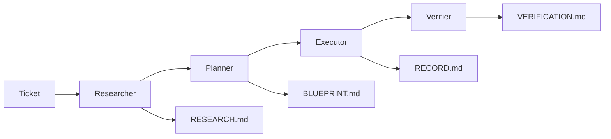

# Agent System Documentation

## Overview

The Agent System provides specialized AI agents that work together to implement software following the AI Assisted Development Framework.

## Architecture

### Agent Registry (`src/agents/agent_registry.ts`)
**Purpose**: Central registry for all available agents
**Features**:
- Agent configuration management
- Dynamic agent discovery
- Agent metadata (name, description, files)

### Agent Rules (`src/agents/agent_rules.ts`)
**Purpose**: Behavioral guidelines and constraints for agents
**Features**:
- Safety constraints
- Development standards
- Quality assurance rules
- Interaction guidelines

### Researcher Agent (`src/agents/researcher_agent.ts`)
**Purpose**: Discovers patterns and maps codebase
**Features**:
- Pattern detection
- Semantic search
- Context building
- Insight generation

### Agent Orchestrator (`src/agent_orchestrator.ts`)
**Purpose**: Manages agent execution and coordination
**Features**:
- Agent lifecycle management
- Context passing between agents
- Pipeline orchestration
- Error handling

## Available Agents

### 1. Researcher Agent
**Name**: ai-researcher
**Purpose**: Discovers patterns and maps codebase
**Input**: Ticket metadata, PRD
**Output**: RESEARCH.md
**Capabilities**:
- Pattern detection (15+ architectural patterns)
- Semantic search with embeddings
- Context building for other agents
- Insight and recommendation generation

### 2. Planner Agent
**Name**: ai-planner
**Purpose**: Creates implementation BLUEPRINTs
**Input**: RESEARCH.md, requirements
**Output**: BLUEPRINT.md
**Capabilities**:
- Epic decomposition
- Task sequencing
- Resource allocation
- Risk assessment

### 3. Executor Agent
**Name**: ai-executor
**Purpose**: Implements code following BLUEPRINT
**Input**: BLUEPRINT.md, context
**Output**: RECORD.md + code
**Capabilities**:
- Code generation
- File operations
- Testing
- Documentation

### 4. Verifier Agent
**Name**: ai-verifier
**Purpose**: Validates implementation
**Input**: All previous outputs
**Output**: VERIFICATION.md
**Capabilities**:
- Requirement validation
- Code quality analysis
- Security review
- Documentation review

## Agent Workflow



## Usage

### Running Individual Agents
```bash
# Run researcher agent
node dist/agent_orchestrator.js research T-001

# Run complete pipeline
node dist/agent_orchestrator.js pipeline T-001

# Start from specific stage
node dist/agent_orchestrator.js pipeline T-001 --start plan
```

### Integration with Repository Intelligence
```typescript
import { ResearcherAgent } from './agents/researcher_agent';

const researcher = new ResearcherAgent();
const context = await researcher.researchTicket("T-001");
```

## Agent Configuration

Each agent is configured in the registry with:
- **Name**: Unique identifier
- **Description**: Agent purpose
- **Prompt File**: System prompt location
- **Input Files**: Required input documents
- **Output File**: Generated output document
- **Required Phase**: SDLC phase requirement

## Safety and Constraints

### Core Principles
- Verify facts before making claims
- Ask for clarification when ambiguous
- Provide evidence-based reasoning
- Consider system-wide impact
- Test assumptions before implementation

### Safety Constraints
- Never execute code without human review
- Validate all inputs and outputs
- Check for security vulnerabilities
- Respect file system boundaries

### Development Standards
- Follow established patterns
- Write comprehensive tests
- Document decisions
- Use type hints
- Implement error handling

## Integration Points

### Repository Intelligence
- Uses Context Builder for intelligent context
- Leverages Search Service for code discovery
- Integrates with Pattern Detector for insights
- Outputs structured results for downstream agents

### Skills Library
- Automatically suggests relevant skills
- Maps patterns to implementation approaches
- Provides best practice guidance

### State Management
- Tracks agent execution state
- Manages context passing
- Handles error recovery

## Error Handling

### Agent-Level Errors
- Graceful degradation
- Error logging and reporting
- Context preservation
- Retry mechanisms

### Pipeline-Level Errors
- Stage failure detection
- Rollback capabilities
- Error propagation
- Human intervention triggers

## Performance

### Execution Time
- **Researcher**: 30-60 seconds
- **Planner**: 20-40 seconds
- **Executor**: 60-300 seconds
- **Verifier**: 30-60 seconds

### Resource Usage
- **Memory**: 100-500MB per agent
- **CPU**: Moderate during analysis
- **Storage**: Minimal (context and outputs)

## Future Enhancements

### Planned Agents
1. **Optimizer**: Performance and optimization
2. **Refactorer**: Code improvement suggestions
3. **Tester**: Automated test generation
4. **Documenter**: Documentation generation

### Advanced Features
1. **Parallel Execution**: Multiple agents running
2. **Agent Collaboration**: Direct agent communication
3. **Learning**: Agent improvement over time
4. **Custom Agents**: User-defined agent types
