# Project Management Framework

This directory contains a reusable framework for project management, ticket systems, backlogs, and templates for AI-assisted development.

## 🔄 Workflow for AI Agents

AI agents should follow the standardized, multi-phase development workflow defined in [AGENTS.md](file:///c:/www/AGENTS.md).

This workflow includes:

1. **Decision Matrix**: Choosing between Lean (Track A) or Full (Track B) tracks based on task complexity.
2. **Backlog Interaction**: Checking `backlog.md` for priorities.
3. **Ticket Initialization**: Creating ticket folders in `epics/EPIC-XXX/tickets/T-XXX/` and using templates.
4. **Phase-Based Execution**: Following the Requirements → Design → Planning → Execution lifecycle.
5. **Memory & Skills**: Utilizing the `memory` skill for persistent knowledge and `skills/` for domain-specific instructions.
6. **Approval & Completion**: Mandatory User checkpoints and status updates.

## 🚀 Project Initiative (PI) Framework

**Project Initiatives (PIs)** are structured release hardening protocols that consolidate multiple epics into production-ready releases.

### PI Structure:
- **PI Manifest**: Defines objectives, epic mapping, and Definition of Done
- **Epic Hardening**: Each epic undergoes systematic hardening before PI completion
- **PI Definition of Done**: Standardized requirements for production readiness

### Typical PI Hardening Requirements:
- PI Gap Analysis (holistic epic connectivity review)
- No Mock Data audit across all epics
- Backend Unit Testing (language-specific targets)
- Frontend Testing baseline (framework-specific)
- Security & Pentest Audit
- Production Release Notes

## 📂 Framework Structure

### Core Project Files
- `project/`: Foundation documents (vision.md, PRD.md, FRD.md, system_architecture.md)
- `ai_lessons.md`: Persistent memory for AI agents to avoid repeating mistakes
- `backlog.md`: Raw ideas and ready-for-review tickets

### Epic Organization
- `epics/`: Epic folders containing multiple tickets
  - Numbered epic folders (epic-000, epic-001, etc.) organized by project scope
  - Each epic contains related tickets for a major feature area
  - Epic structure adapts to project domain and requirements

### Design & Templates
- `design/`: Design bible (sitemap.md, style_guide.md, interaction_guide.md)
- `design_template/`: Reusable design templates
- `epic_template/`: Standard epic and ticket templates

### Each Ticket Contains:
- `requirements/README.md`: Problem understanding and requirements
- `design/README.md`: System architecture and design decisions
- `planning/README.md`: Task breakdown and project planning
- `implementation/README.md`: Implementation guides and notes
- `testing/README.md`: Testing strategy and test cases
- `deployment/`: Deployment and infrastructure docs
- `monitoring/`: Monitoring and observability setup

## � Development Process

### Phase-Based Workflow
1. **Requirements Phase**: Define problems, user needs, and acceptance criteria
2. **Design Phase**: Create system architecture, API contracts, and technical specifications
3. **Planning Phase**: Break down work, estimate effort, and create implementation roadmap
4. **Implementation Phase**: Write code following established patterns and conventions
5. **Testing Phase**: Execute unit tests, integration tests, and validation procedures
6. **Deployment Phase**: Deploy to staging/production with proper monitoring

### Quality Gates
- **Epic Hardening**: Systematic review before PI inclusion
- **PI Definition of Done**: Standardized production readiness criteria
- **Memory Integration**: Continuous learning and pattern documentation

## 📋 Quick Reference

- **Start Work**: Check `backlog.md` → Create ticket → Follow phases
- **PI Management**: Review `epics/PI-XXX_Manifest.md` for current initiatives
- **Design Guidelines**: Follow `design/` Design Bible
- **Memory Check**: Always read `ai_lessons.md` before starting work
- **Templates**: Use `epic_template/` for consistent documentation

## 🎯 Framework Benefits

- **Scalable Structure**: Adapts to projects of any size and domain
- **Consistent Process**: Standardized workflow across all teams and AI agents
- **Quality Assurance**: Built-in testing and review processes
- **Knowledge Persistence**: Continuous learning through documented lessons
- **Release Management**: Structured approach to production releases

## 🌊 Three-Layer SDLC Waterfall Process

```mermaid
graph TD
    A[Layer 1: Ticket-Level Flow<br/>Developer Velocity] --> B[Layer 2: Epic-Level Flow<br/>Release Hardening]
    B --> C[Layer 3: Production Release<br/>Deployment & Monitoring]
    
    subgraph "Layer 1: Ticket-Level Flow"
        direction LR
        A1[Ideation] --> A2[Ticket Creation] --> A3[Requirements] --> A4[Design] --> A5[Implementation] --> A6[Testing] --> A7[Merge to Epic]
    end
    
    subgraph "Layer 2: Epic-Level Flow"
        direction LR
        B1[Harden Epic] --> B2[Verify Integration] --> B3[Deploy to Staging] --> B4[Observe & Monitor] --> B5[Document Release]
    end
    
    subgraph "Layer 3: Production Release"
        direction LR
        C1[Final Security Audit] --> C2[Production Deployment] --> C3[Error Budget Alerting] --> C4[User Retention Tracking] --> C5[Release Notes]
    end
    
    style A fill:#e1f5fe
    style B fill:#f3e5f5
    style C fill:#e8f5e8
```

### Layer Descriptions

**Layer 1: Ticket-Level Flow (Developer Velocity)**
- Focus: Fast execution and feature development
- Process: Ideation → Requirements → Design → Implementation → Testing → Merge
- Environment: Feature branches, local validation
- No deployment or security overhead

**Layer 2: Epic-Level Flow (Release Hardening)**
- Focus: Quality assurance and integration testing
- Process: Harden → Verify → Deploy → Observe → Document
- Environment: Staging, integration testing
- Triggered when epic is ready for release

**Layer 3: Production Release**
- Focus: Production deployment and monitoring
- Process: Security audit → Deploy → Monitor → Track → Document
- Environment: Production, observability tools
- Final release validation and user impact measurement
