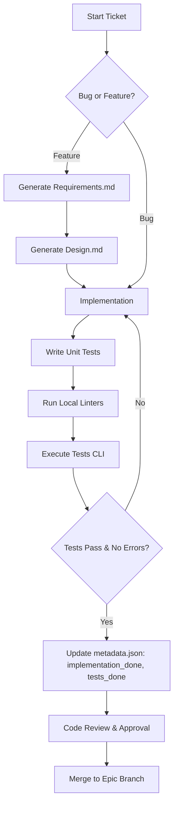
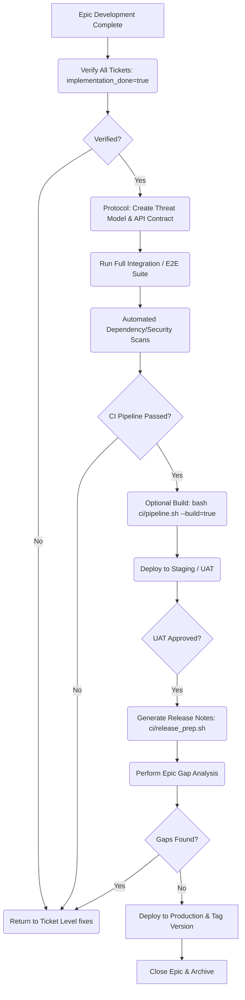
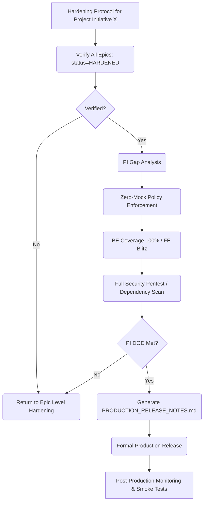

# Production SDLC Process Diagrams

This document contains visual representations of our Two-Layer Workflow and project lifecycle using Mermaid diagrams.

## 1. High-Level Process (End-to-End)

This demonstrates the macro relationship between ideation, the fast-track ticket flow, and the release-hardening epic flow.

```mermaid
graph TD
    A[Ideation / Backlog] --> B(Project / Epic Scoping)
    B --> C{Epic Created}

    subgraph Ticket-Level Flow (Developer Velocity)
        C --> D[Ticket 1: UI]
        C --> E[Ticket 2: API]
        C --> F[Ticket N...]

        D --> D1(Define Requirements) --> D2(Design) --> D3(Implement & Unit Test) --> D4(Local Validate) --> D5(Merge to Epic Branch)
        E --> E1(Define Requirements) --> E2(Design) --> E3(Implement & Unit Test) --> E4(Local Validate) --> E5(Merge to Epic Branch)
    end

    D5 --> G{All Tickets Complete?}
    E5 --> G

    subgraph Epic/Release-Level Flow (Hardening)
        G -- Yes --> H(Threat Model / Security Review)
        H --> I(Integration & E2E Tests)
        I --> J{Optional Build Verification}
        J -- --build=true --> J1(Full CI Build Check)
        J1 --> K
        J -- default --> K(Staging Deploy & UAT)
        K --> L(Release Notes & Monitor Config)
        L --> M[Production Release]
        M --> N(Epic Gap Analysis & Closure)
    end
```

---

## 2. Ticket-Level Process (The Fast Track)

Optimized for speed, focus, and clean PR discipline. No deployment ceremonies here.



---

## 3. Epic-Level Process (The Hardening Track)

Triggered when a cohesive feature is ready to ship. Focuses on stability and security.



---

## 4. Starting a New Project / Epic Process

The initialization sequence to ensure proper folder structure and metadata isolation before any AI code generation begins.

```mermaid
    A[Start New Project] --> B(Copy Foundation Templates)
    B --> C(AI Interview to fill Vision, PRD, FRD, Epic Backlogs)
    C --> D[Save to /project-management/project/]
    D --> E(Design Phase / Stitch Generation)
    E --> F[Export Mockups to /project-management/design/]
    F --> G(Update screen_list.md & Map to Epics)

    G --> H{Iterate through epic_backlogs.md}
    H --> I(Run Epic Scoping Prompt)
    I --> J[AI Generates /project-management/epics/[EPIC-NAME]/tickets/]
    J --> K[Link tickets to specific screens in screen_list.md]
    K --> L(Validate Requirements, Design links & Mockups)

    L -- Validation Fails --> J
    L -- Validation Passes --> M{More Epics?}
    M -- Yes --> H
    M -- No --> N[Begin Ticket-Level Implementation Sequentially]

    N --> EH_A{All Tickets Complete?}

    subgraph Epic/Release-Level Flow (Hardening)
        EH_A -- Yes --> EH_B(Threat Model / API Contract Review)
        EH_B --> EH_C(E2E Integration & Versioning)
        EH_C --> EH_D(Security Scan & Optional Build)
        EH_D --> EH_E(Staging Deploy & UAT)
        EH_E --> EH_F(Release Notes & Gap Analysis)
        EH_F --> EH_G[Production Release]
    end

    EH_G --> O[Close Epic]
subgraph PI/Release-Level Flow (Production Readiness)
    O --> PI_A{All Epics in PI Hardened?}
    PI_A -- Yes --> PI_B(Initialize PI Manifest: start PI-X)
    PI_B --> PI_C(Holistic Gap Analysis)
    PI_C --> PI_D(Zero-Mock & Performance Audit)
    PI_D --> PI_E(Full Security & Pentest Blitz)
    PI_E --> PI_F(Generate PRODUCTION_RELEASE_NOTES.md)
    PI_F --> PI_G[Production Deployment]
end
```

---

## 5. Project Initiative (PI) Process

The final gate before production, focusing on cross-epic synergy and enterprise quality.


