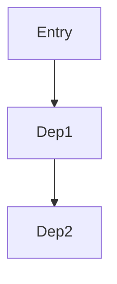

# SKILL: Knowledge Capture

## Problem

Knowledge is lost because:
- Code exists without context
- Dependencies are unclear
- Design decisions not documented
- New team members struggle to understand

## Solution Overview

Systematic knowledge capture:
1. Gather and validate entry point
2. Collect source context
3. Analyze dependencies
4. Synthesize understanding
5. Create structured documentation

## Implementation

### When to Use

- Documenting a module or component
- Understanding complex code
- Mapping dependencies
- Capturing design decisions
- Preserving institutional knowledge

### Entry Points

- **File**: Document a single file's purpose and exports
- **Folder**: Map directory structure and key modules
- **Function**: Capture signature, logic, and usage
- **API**: Document endpoints, request/response, errors
- **Service**: Understand service boundaries and interactions

## Workflow

### Phase 1: Gather & Validate

**Activities**:
1. Confirm entry point
2. Verify it exists
3. Define desired depth (summary vs detailed)
4. Resolve ambiguity

**Output**:
```markdown
## Entry Point
- **Type**: {file/folder/function/API}
- **Location**: `path/to/entry`
- **Purpose**: {one sentence}
- **Depth**: {summary/detailed}
```

### Phase 2: Collect Source Context

**For Files**:
- Summarize purpose
- List exports
- Note key patterns used

**For Folders**:
- List structure
- Highlight key modules
- Note organization pattern

**For Functions/APIs**:
- Capture signature
- Document parameters
- Note return values
- List error handling

**Output**:
```markdown
## Source Context
**Purpose**: {what it does}
**Exports**: {list}
**Patterns**: {architectural patterns used}
```

### Phase 3: Analyze Dependencies

**Build Dependency Graph** (depth 3):
- Track visited nodes (avoid loops)
- Categorize:
  - Internal imports
  - Function calls
  - Services
  - External packages

**Exclude**:
- External systems
- Generated code
- Standard library (unless critical)

**Output**:
```markdown
## Dependencies

### Direct (Depth 1)
- `module_a`: {purpose}
- `module_b`: {purpose}

### Indirect (Depth 2-3)
- `module_c` → `module_d`: {relationship}
```

### Phase 4: Synthesize

**Create Understanding**:
- Overview (purpose, language, behavior)
- Core logic and execution flow
- Design patterns identified
- Error handling approach
- Performance considerations
- Security implications
- Improvements or risks discovered

**Output**:
```markdown
## Analysis

### Overview
{High-level summary}

### Core Logic
{Key algorithms and flows}

### Patterns
{Architectural patterns}

### Considerations
- **Error Handling**: {approach}
- **Performance**: {notes}
- **Security**: {implications}
- **Risks**: {potential issues}
```

### Phase 5: Create Documentation

**File Naming**:
- Convert to kebab-case: `calculateTotalPrice` → `calculate-total-price`
- Location: `docs/ai/implementation/knowledge-{name}.md`

**Content Structure**:
```markdown
# Knowledge: {Name}

## Overview
{Purpose and context}

## Implementation Details
{How it works}

## Dependencies
{Dependency graph}

## Visual Diagrams
```mermaid
{flowchart or diagram}
```

## Additional Insights
- {Key learning}
- {Open question}
- {Related area to explore}
```

## Key Principles

1. **Validate First**: Confirm entry point before analyzing
2. **Depth Control**: Match detail level to need
3. **Loop Prevention**: Track visited nodes in dependency analysis
4. **Mermaid Diagrams**: Visualize flows and relationships
5. **Insight Capture**: Note discoveries, not just facts
6. **Kebab Naming**: Consistent file naming convention

## Integration

- **Memory** (`memory-v1`): Store key insights
- **Documentation** (`documentation-v1`): Review outputs
- **Planner** (`planner-v1`): Reference for understanding

## Validation Checklist

- [ ] Entry point validated and exists
- [ ] Source context collected
- [ ] Dependencies analyzed (depth 3)
- [ ] Synthesis includes all aspects
- [ ] File named kebab-case
- [ ] Location: `docs/ai/implementation/`
- [ ] Mermaid diagrams included (if helpful)
- [ ] Key insights documented
- [ ] Open questions noted
- [ ] User reminded to commit

## Common Mistakes

- **No Validation**: Analyzing wrong/non-existent code
- **Too Shallow**: Not analyzing dependencies
- **Infinite Loops**: Not tracking visited nodes
- **Missing Insights**: Just facts, no learnings
- **No Diagrams**: Text-only when visual would help
- **Wrong Location**: Not in `docs/ai/implementation/`

## Output Template

```markdown
# Knowledge: {entry-point-name}

## Overview
- **Type**: {file/folder/function/API}
- **Location**: `path`
- **Purpose**: {one sentence}
- **Language**: {tech stack}

## Implementation Details
{How it works, key logic}

## Dependencies

### Direct
- `dep1`: {purpose and relationship}

### Indirect
- `dep2` → `dep3`: {relationship chain}

## Visual Diagrams


## Additional Insights
- **Key Learning**: {important discovery}
- **Open Question**: {unresolved aspect}
- **Related Areas**: {where to explore next}
- **Risks**: {potential issues}

## Version
- **Captured**: {date}
- **By**: {agent/person}
```

## Version History

| Version | Date | Changes | Author |
|---------|------|---------|--------|
| 1.0.0 | 2024-03-07 | Migrated from capture-knowledge skill | tita-chi |
